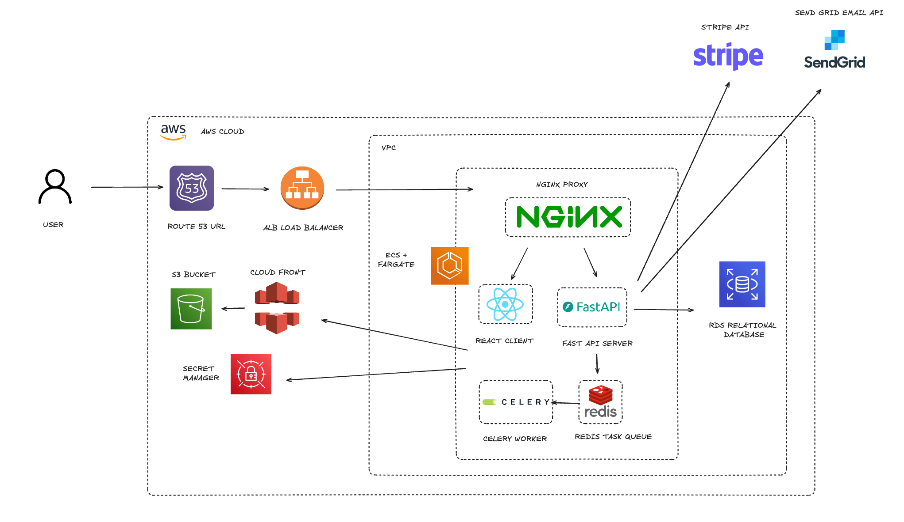

# Tubetip.co documentation

Tubetip.co is a web application that enables people to give financial support to their favourite Youtube content creators.  

Unlike YouTube "Super Thanks", we don't take 60% fees and anyone can sign up, no matter the YouTube channel size.

## Set up locally

To get this app running locally:
- git clone the repository
- create backend ```.env``` file and populate with ```.env.sample``` variables
- Have stripe webhooks for connect and checkout running
- run ```docker compose up --build``` in root

## Architecture

**Technologies**:

- React (frontend)
- FastAPI (backend)
- NGINX (proxy)
- Redis (task queue)
- Celery (background worker)

**External**:

- Sendgrid (email service)
- Stripe (payment service)

**Diagram**:

